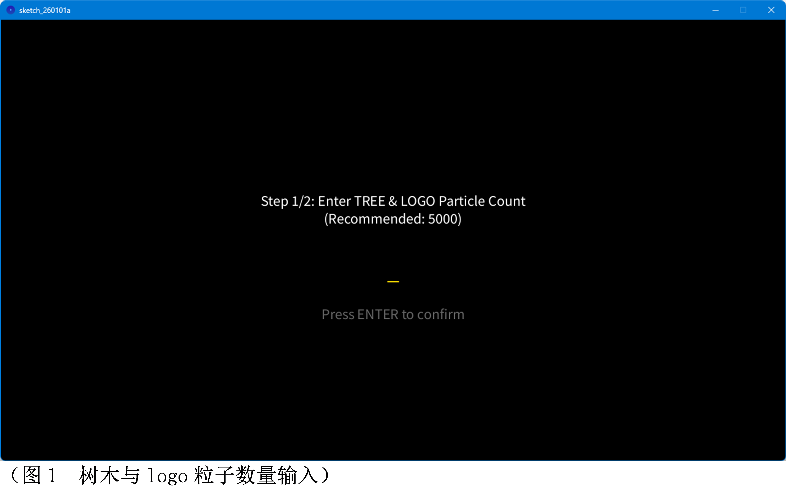
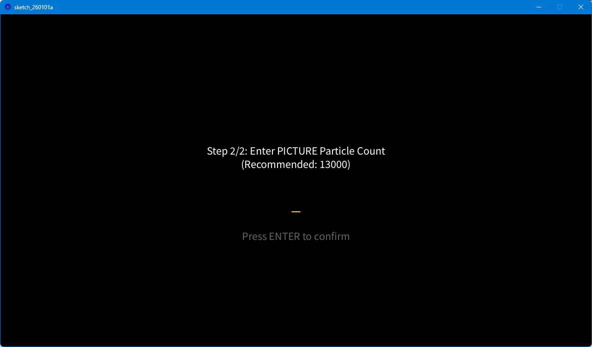
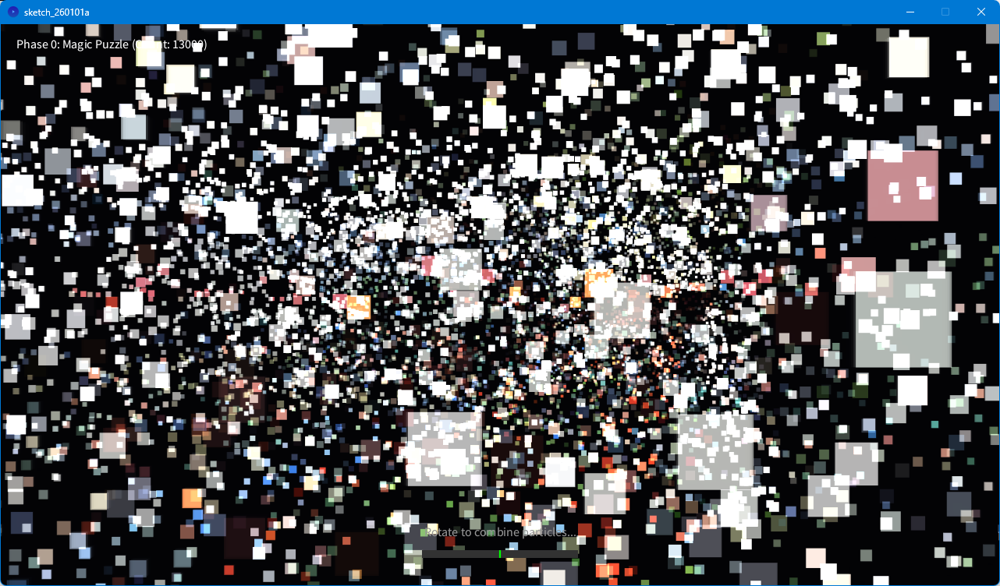
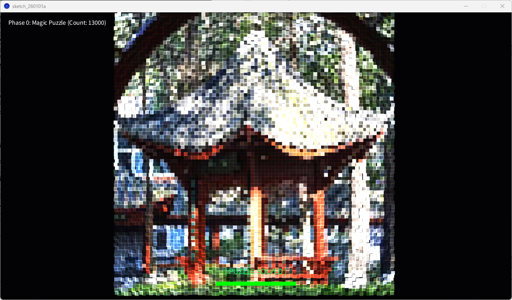
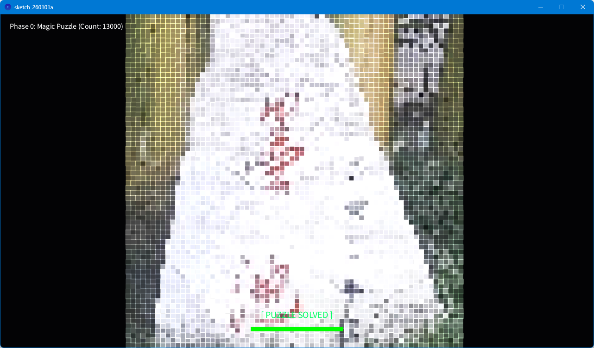
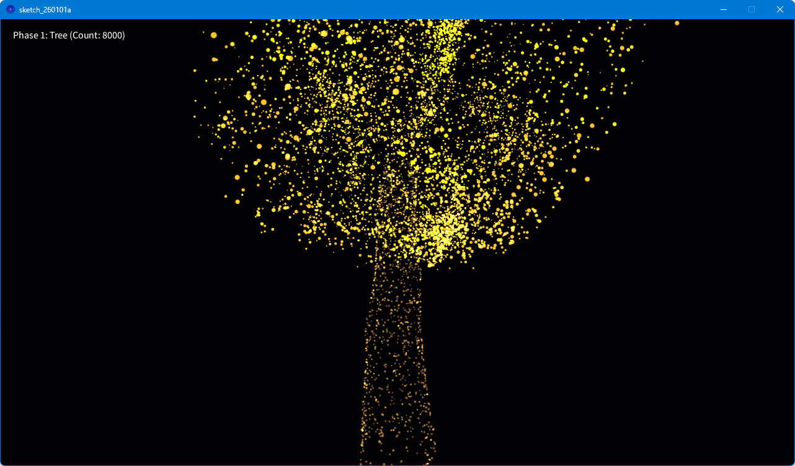
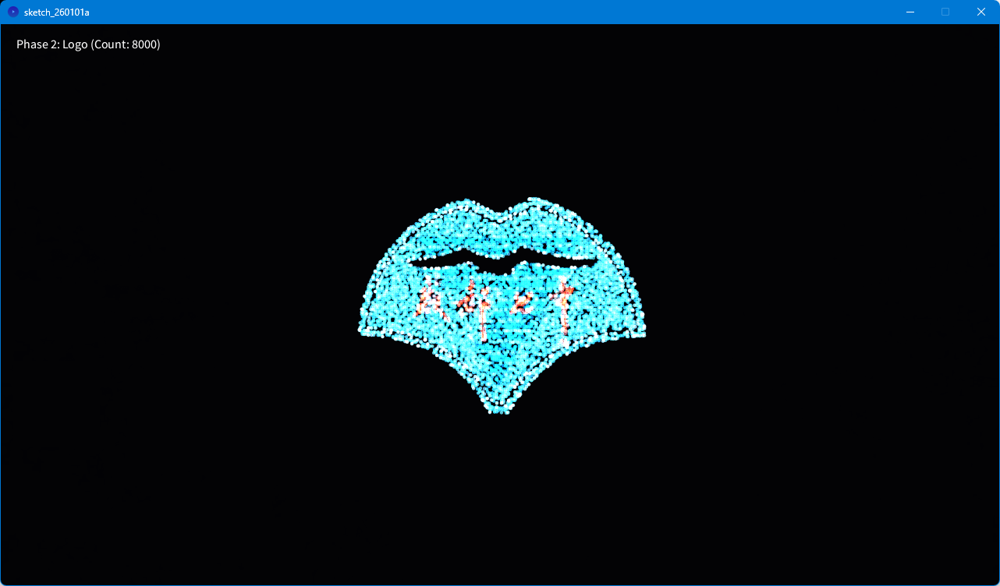
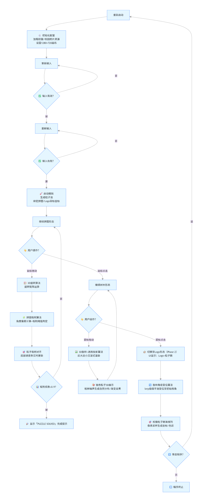
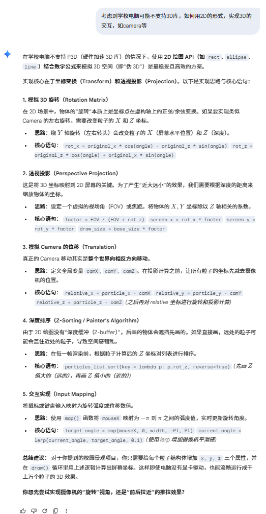
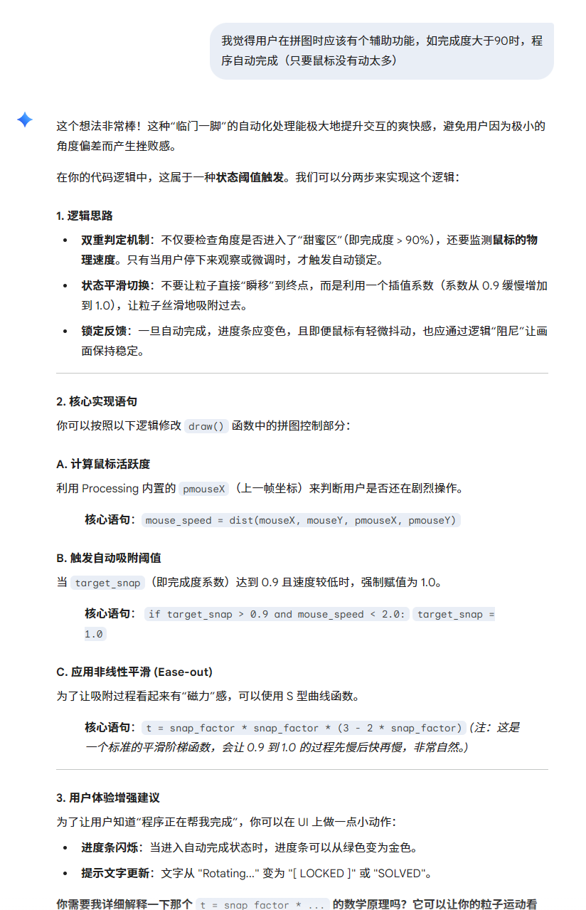

# 校园光影粒子幻境（Campus Particle Wonderland）

**成都七中 · 2 班 · Skn 队** 原创 Processing 交互作品

本项目以成都七中的校园文化为灵感，用 3D 粒子系统把**银杏树、校园标志性建筑（亭子、墨池）、校徽**等代表性元素重构为可交互的视觉幻境。作品基于 Processing Python Mode 编写，全部代码与算法均为团队原创。

> 🎓 校园文化 × 编程创意 × 粒子技术：让静态的校园记忆“动”起来。

---

## 演示视频

<video src="docs/demo.mp4" poster="docs/demo-poster.jpg" controls preload="metadata" style="max-width:100%;border-radius:8px;"></video>

> 仓库内为 720p 压缩版演示视频（约 51 MB），完整 4K 原片见本地文件 `演示视频.mp4`。

---

## 作品立意

校园里金黄的银杏、古朴的亭子、静默的墨池与醒目的校徽，承载着每一位七中学子的记忆。本作品以数字化方式重构这些校园符号：

- 用 **上万个粒子** 拼出校园照片、银杏树与校徽；
- 通过鼠标旋转视角，粒子在 **拼图 → 银杏树 → 校徽** 三种形态间无缝变换；
- 让校园文化从静态图片走向可体验、可交互的动态呈现。

作品既是一次校园文化传播的创新尝试，也探索了技术与文化融合的实践路径：粒子动态变换让校园精神符号可视化、互动化，助力校园文化的传承与传播。

---

## 核心特性

### 粒子多形态平滑切换

同一套粒子系统可在三种形态间流畅重组，全程无视觉割裂：

| 阶段 | 形态 | 说明 |
| --- | --- | --- |
| Phase 0 | **Magic Puzzle 校园拼图** | 粒子散落于 3D 空间，旋转视角到 0° / ±90° 时触发智能吸附，拼出正面、侧面两张校园建筑照片 |
| Phase 1 | **银杏树** | 粒子按柏林噪声分布，重组为 3D 银杏树，金色叶片自然渐变 |
| Phase 2 | **校徽 Logo** | 粒子按像素采样复刻校徽色彩与轮廓，视角自动复位，完整呈现 |

### 3D 立体沉浸式渲染

基于透视投影与旋转矩阵运算构建 3D 空间，支持 X / Y 轴自由旋转，模拟真实空间透视（近大远小）。

### 智能吸附拼接

拼图模式下，视角靠近 0°（正面）、90° 或 -90°（侧面）时，系统自动计算角度偏差并触发吸附：粒子向对应照片的像素位置对齐，界面底部进度条实时反馈，吸附完成显示 `[ PUZZLE SOLVED ]`。

### 粒子色彩动态适配

- 银杏叶粒子通过**柏林噪声**生成渐变金黄色调，还原自然银杏；
- 校徽与校园照片粒子精准复刻原图色彩；
- 拼图吸附时非当前视角粒子透明度随进度渐变淡出，强化视觉焦点。

---

## 运行方法

### 环境要求

- [Processing 4](https://processing.org/download)（含 Python Mode 扩展，或 Processing Python 发行版）
- 需与 `sketch_260101a/data/` 素材目录一同运行

### 步骤

1. 打开 `sketch_260101a/sketch_260101a.pyde`；
2. 点击运行，进入参数配置界面：
   - **Step 1/2**：输入树与校徽 Logo 的粒子数量（推荐 5000，上限 20000）；
   - **Step 2/2**：输入拼图粒子数量（推荐 13000，上限 100000）；
   - 按回车确认，开始模拟。
3. 鼠标交互：
   - **移动鼠标**：旋转 3D 场景；
   - **点击鼠标**：依次切换 拼图 → 银杏树 → 校徽；
   - 拼图模式下旋转视角触发智能吸附，完成校园照片拼接。

---

## 技术实现

| 模块 | 实现要点 |
| --- | --- |
| 3D 粒子引擎 | 自研粒子类 `GinkgoParticle`，统一管理位置、颜色、大小与形态目标 |
| 图像粒子化 | 遍历图片像素采样生成粒子坐标，`process_puzzle_pixels()` / `process_logo_pixels()` |
| 树形生成 | 柏林噪声（`noise()`）控制叶片分布、树干形态与金黄色渐变 |
| 透视投影 | 基于 `FOV` 与旋转矩阵计算屏幕坐标，实现近大远小 |
| 吸附算法 | 角度偏差计算 + 阈值判定 + 平滑插值（`lerp`），粒子向目标像素对齐 |
| 色彩过渡 | `lerpColor()` 实现粒子颜色平滑渐变 |
| 性能优化 | 粒子数量自定义、非目标粒子透明度降级、批量绘制 |

---

## 项目结构

```text
.
├── README.md
├── sketch_260101a/
│   ├── sketch_260101a.pyde      # Processing Python Mode 主程序
│   ├── sketch.properties
│   └── data/                    # 校徽 Logo 与校园照片素材
├── sketch_260101a.zip           # 打包好的可直接运行草图
├── docs/
│   ├── demo.mp4                 # 演示视频（720p 压缩版）
│   ├── demo-poster.jpg
│   ├── 作品设计文档.docx         # 完整设计文档
│   └── images/                  # 设计文档中的截图与流程图
└── 演示视频.mp4                  # 4K 原片（仅本地，未上传）
```

---

## 作品截图

**图1 · 树与 Logo 粒子数量输入**



**图2 · 照片粒子数量输入**



**图3 · 粒子分散态**



**图4 · 粒子拼好后的亭子**



**图5 · 墨池石头**



**图6 · 旋转银杏树**



**图7 · 粒子校徽**



---

## 设计文档

完整的作品设计文档（立意、功能说明、使用说明、算法流程等）见 [docs/作品设计文档.docx](docs/作品设计文档.docx)。

**算法流程图**



<details>
<summary><b>与 AI 对话的截图</b>（点击展开）</summary>





</details>

---

## 校园素材说明

`sketch_260101a/data/` 中存放了本作品使用的校园素材：

| 文件 | 用途 |
| --- | --- |
| `logo.png` | 校徽，Phase 2 粒子校徽形态的目标图像 |
| `picture5.png` | 拼图正面（校园标志性建筑照片） |
| `picture3.png` | 拼图侧面（校园标志性建筑照片） |
| `picture1/2/4/6/7/11` | 校园照片素材（亭子、墨池等） |

---

## 团队与分工

| 成员 | 班级 | 分工 |
| --- | --- | --- |
| 谭涞恩 | 2 班 | 核心算法实现、3D 粒子物理引擎开发、程序代码编写与调试 |
| 郭子茹 | 2 班 | 美术设计、图像资源优化、粒子视觉效果调校、界面视觉风格统一 |
| 张瑞杰 | 2 班 | 作品创意构思、需求分析、功能逻辑规划与测试验证 |

---

本作品为成都七中校园文化数字化的原创尝试，仅供学习交流使用。
